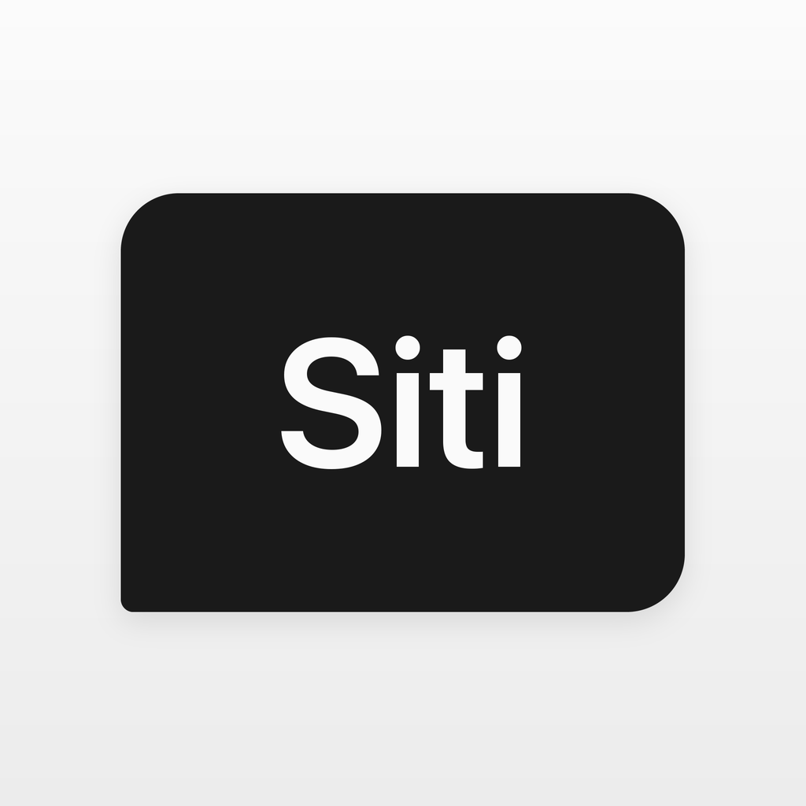

<p align="center">
  
</p>

<h1 align="center">Siti AI</h1>

<p align="center">
  <strong>A private, on-device AI assistant for macOS, iOS, and Android.</strong><br>
  Your model runs locally. Your chats never leave the device.
</p>

<p align="center">
  <a href="https://apps.apple.com/se/app/siti-ai/id6780047972"></a>
  <a href="https://play.google.com/store/apps/details?id=ai.siti.Siti"></a>
  <a href="https://github.com/ondeinference/onde"></a>
  <a href="LICENSE"></a>
  <a href="https://github.com/sponsors/ondeinference"></a>
</p>

<p align="center">
  <a href="https://getsiti.5mb.app">Website</a> ·
  <a href="#quick-start">Quick start</a> ·
  <a href="#architecture">Architecture</a> ·
  <a href="CONTRIBUTING.md">Contributing</a> ·
  <a href="SECURITY.md">Security</a>
</p>

---

Siti AI is the assistant you already know, rebuilt around privacy. It loads an
open-weights language model onto your device and runs inference entirely
locally — no server round-trip, no account, nothing to leak. The name is a wink
at the assistant on your phone; the difference is where your words go.

**Siti is also the flagship open reference app for [Onde](https://ondeinference.com)** —
the on-device inference engine that powers it. If you want to see Onde driving a
real, shipping app on the App Store and Google Play, this is the codebase to read.

## Why it exists

The device you keep closest to you should be the one that keeps your data
private. Most assistants send everything you type to a remote server; Siti keeps
it on your device instead. Using AI shouldn't be the price you pay to give that
up.

## Features

- **Fully on-device inference** — chat runs locally via [Onde](https://crates.io/crates/onde): Metal-accelerated on Apple silicon, CPU on Android.
- **Bring your own model** — pick from on-device open-weights models; download and swap them in-app.
- **No account, no telemetry of your chats** — conversations stay on the device.
- **Native and small** — Rust core + Tauri, a real app rather than a web wrapper.

## Quick start

**Prerequisites:** [Rust](https://rustup.rs) (stable), [pnpm](https://pnpm.io),
and the [Tauri prerequisites](https://tauri.app/start/prerequisites/) for your
platform (Xcode for macOS/iOS; Android SDK + NDK for Android).

```bash
git clone https://github.com/getsigit/siti.git
cd siti
pnpm install
make dev          # or: pnpm tauri dev
```

The first launch downloads a model; after that, inference is offline. The Onde
engine is pulled from crates.io — no separate SDK checkout needed. To develop
against a local Onde checkout, see the commented `[patch.crates-io]` block in
`src-tauri/Cargo.toml`.

Common tasks:

```bash
make dev      # start the Tauri dev server
make build    # debug build
make fmt      # cargo fmt
make lint     # clippy + tsc
```

## Architecture

Siti is a thin, native shell around the Onde inference engine.

```
┌──────────────────────────────┐
│  React + Vite UI (src/)       │  chat view, model settings
├──────────────────────────────┤
│  Tauri command layer          │  src-tauri/src/chat/command_*.rs
│  (load/unload model, send,    │  typed IPC between UI and Rust
│   stream tokens, history)     │
├──────────────────────────────┤
│  Onde engine (crates.io)      │  GGUF load + streaming generation;
│  Metal on Apple, CPU on       │  Metal-accelerated on Apple silicon
│  Android                      │
└──────────────────────────────┘
```

Things worth reading if you're evaluating the engineering:

- `src-tauri/src/chat/` — the command surface: model lifecycle, streaming token
  events, and history. This is the cleanest example of wiring Onde into an app.
- `src-tauri/src/chat/mod.rs` — token-budget heuristics (reasoning models burn
  a large `<think>` budget before the visible reply begins).
- `src-tauri/src/setup/` — redirecting the model cache into the App Group
  container so the sandbox doesn't fight the download.
- `src-tauri/.cargo/config.toml` — the `+fullfp16` target-feature notes for
  Apple silicon fp16 SIMD. Non-obvious, and load-bearing.

## Repository layout

| Path       | What                                            |
| ---------- | ----------------------------------------------- |
| `/`        | Tauri + Vite desktop/mobile app (the product)   |
| `src/`     | React UI                                         |
| `src-tauri/` | Rust core, Tauri commands, platform config    |
| `web/`     | Next.js marketing + legal site (getsiti.5mb.app) |

## The Onde SDK

The inference engine is developed separately and is open source under
MIT OR Apache-2.0, with SDKs for several ecosystems:

[Rust](https://crates.io/crates/onde) ·
[Swift](https://github.com/ondeinference/onde-swift) ·
[Kotlin Multiplatform](https://central.sonatype.com/artifact/com.ondeinference/onde-inference) ·
[Flutter](https://pub.dev/packages/onde_inference) ·
[React Native](https://www.npmjs.com/package/@ondeinference/react-native) ·
[CLI](https://github.com/ondeinference/onde-cli) ·
[Docs](https://ondeinference.com/sdk)

If Siti is useful to you, the engine underneath it probably is too.

## Contributing

Contributions are welcome — see [CONTRIBUTING.md](CONTRIBUTING.md). We ask
contributors to sign a lightweight [CLA](CLA.md) so the project can keep both
its open-source and commercial licensing options open. Start with issues labeled
[`good first issue`](https://github.com/getsigit/siti/labels/good%20first%20issue).

## Sponsor

Siti is built by [PT Sigit Mitra Bangun](https://sigit.si) and published
by Splitfire AB, which also builds the underlying Onde engine. On-device AI
that keeps user data private is worth funding — if you agree,
[**sponsor us on GitHub**](https://github.com/sponsors/ondeinference). Sponsorship
funds the engine, the SDKs, and this app.

## Security & privacy

Chat content is processed on-device and is not transmitted to us. To report a
vulnerability, see [SECURITY.md](SECURITY.md) — please do not open a public
issue for security reports.

## License

Code is licensed under [Apache-2.0](LICENSE). The "Siti AI" name, logos, and app
icons are trademarks of PT Sigit Mitra Bangun and are **not** covered by the code license —
see [TRADEMARK.md](TRADEMARK.md).
